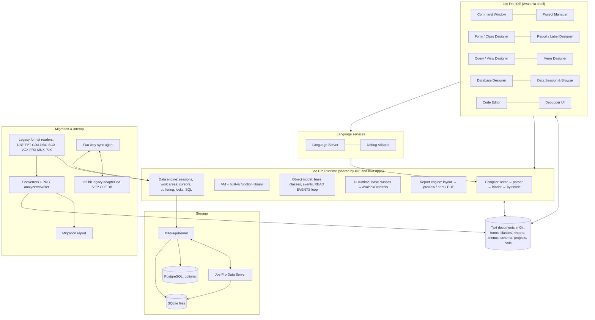

# 02 — Proposed Architecture

> Status: **Draft for review**. Decisions marked **🔷 Decision needed** are listed again in
> the [plan index](README.md) for sign-off.

## 1. Stack decision

### 1.1 Options considered

| Option | Strengths | Weaknesses for *this* project | Verdict |
|---|---|---|---|
| **C# / .NET 10 + Avalonia UI** | Strong fit for native Windows desktop, high-DPI and dark-mode ready. Runtime code generation (IL / expression trees) for a scripting language. Mature COM interop (VFP apps call `CREATEOBJECT("Excel.Application")` all the time). Large ecosystem (SQLite, PDF, ODBC). Avalonia draws its own controls, which makes design-time adorners and pixel-consistent form rendering easier, and keeps macOS/Linux open later. MIT licensed. | Avalonia apps don't look "native Win32" by default (with Fluent theme they look like modern Windows apps). ActiveX hosting needs `NativeControlHost` interop work. | **Recommended** |
| C# / .NET 10 + WPF | The most mature Windows UI stack. Built-in adorner layer, AvalonDock, straightforward ActiveX hosting via WindowsFormsHost. Fluent theme in .NET 9+. | Windows-only forever. Aging API surface, and dark mode and theming take more work. | **Strong alternative**, nearly a coin flip with Avalonia |
| C# / .NET + WinUI 3 | The newest Microsoft look | Slower-moving tooling, weaker support for custom design surfaces, harder distribution. | Rejected |
| Rust + Tauri (web UI) | Performance and memory safety. Small binaries. | A form designer rendering *runtime* controls in a webview means two UI worlds. COM interop is painful, and building a custom language and debugger takes longer. | Rejected |
| TypeScript + Electron | Fast UI iteration, Monaco editor for free | Heavy footprint, weak COM, poor fit for a local data engine with navigational cursors, "not native". | Rejected |
| C++ + Qt | Performance, mature widgets | Slowest development speed for a scope this big. Licensing cost or LGPL constraints. | Rejected |
| Build on **X#** (xBase compiler for .NET) for the language | A FoxPro dialect already exists | We would give up control of the core product (semantics, debugger, error messages, roadmap) to a third party with its own license. Its runtime model is not ours. | Rejected as a dependency; used as reference only |

**🔷 Decision needed D1 — UI framework.** I recommend **Avalonia**. It gives optionality
(future macOS/Linux IDE or runtime), a self-drawn control model that suits both the
designers and the runtime, and modern theming. Pick **WPF** if Windows-only is a
permanent guarantee and ActiveX-heavy legacy apps are the norm among target customers.
The rest of the architecture is the same either way, because UI sits behind the
`JoePro.Ui.*` boundary.

### 1.2 Data storage kernel

| Option | Assessment |
|---|---|
| Write our own DBF-like storage engine | Years of work to reach ACID durability and crash safety. Rejected. |
| **SQLite** (embedded) | Proven ACID, WAL (one writer, many concurrent readers), a single-file database, **expression indexes over custom deterministic functions** (so we can register `UPPER`, `DTOS`, `STR`, `PADL` and index on VFP expressions like a CDX), **partial indexes** (= `FOR` clause indexes), custom collations (= `SET COLLATE`). Excellent .NET support. **Chosen as the storage kernel.** |
| Firebird (embedded + server) | MVCC with true concurrent writers, same file in embedded and server mode. But custom functions for expression indexes are much harder to host. Kept as a fallback candidate. |
| PostgreSQL | Best server engine, but not embeddable. Supported as an **optional backend** for large sites, the way VFP used remote views. |
| DuckDB | Analytical, not OLTP. May be used later for reporting acceleration only. |

Important: **SQLite is not reachable by users directly.** Joe Pro's data engine
implements FoxPro semantics (work areas, record pointers, record numbers, deleted flags,
buffering, VFP comparisons and SQL dialect) *on top of* SQLite. SQLite is an
implementation detail behind a `IStorageKernel` interface, which also makes the
PostgreSQL backend possible.

**SQLite must never be opened over an SMB file share by several machines** (its locking
is unreliable over network file systems). This is exactly the classic VFP deployment
("DBFs on the F: drive"). So multi-user deployments use the **Joe Pro Data Server**
(§3.5). This is the "safer, faster concurrent multi-user model" improvement.

### 1.3 Other building blocks
- **Code editor:** AvaloniaEdit (TextMate grammars + our semantic highlighting) driven by
  our own **Language Server (LSP)**. The same server gives a free VS Code extension.
- **Debugger protocol:** **Debug Adapter Protocol (DAP)**. The IDE debugger UI and
  VS Code both speak it.
- **Docking:** Dock.Avalonia (or AvalonDock with WPF).
- **PDF:** PDFsharp/MigraDoc (MIT) for export. Our own layout engine produces a page
  model that renders to screen (preview), printer (Windows print API) and PDF.
- **External data:** ADO.NET + ODBC for SQL pass-through and remote views. Microsoft
  OLE DB for COM-era sources.
- **Packaging:** .NET self-contained single-file publish for built apps (the
  "Joe Pro runtime", analogous to `VFP9R.DLL`). MSIX or WiX installer for the IDE.
- **Targets:** Windows 10 22H2+ and Windows 11, x64 first, ARM64 second.

---

## 2. System overview



The core principle is that **the IDE is a client of the runtime**, the same way VFP's IDE
was written largely on top of VFP. Designers edit *documents*. The runtime executes
*documents*. Built apps contain the runtime plus documents compiled to bytecode, and no
IDE.

### 2.1 Solution layout (planned)

```
src/
  JoePro.Core              values, types, VFP comparison/date/numeric semantics, collations, errors
  JoePro.Data              data sessions, work areas, cursors, indexes, buffering, locks, transactions, DBC model
  JoePro.Data.Sqlite       IStorageKernel on SQLite
  JoePro.Data.Postgres     IStorageKernel on PostgreSQL (later)
  JoePro.Sql               SELECT-SQL parser, binder, planner, executor, SQLite translation
  JoePro.Language          lexer, parser, AST, preprocessor, binder, bytecode compiler
  JoePro.Runtime           VM, built-in commands and functions, object model, event loop, SET state
  JoePro.Ui.Runtime        base classes rendered on Avalonia, data binding, READ EVENTS
  JoePro.Reports           report model, layout engine, preview, print, PDF/other exports
  JoePro.Documents         canonical text formats + serializers (forms, classes, reports, menus, schema, projects)
  JoePro.LanguageServer    LSP implementation
  JoePro.Debugging         DAP implementation, breakpoints, event tracking, coverage
  JoePro.Ide               shell, docking, command window, designers, project manager
  JoePro.Server            multi-user data server (Windows service)
  JoePro.Packages          package manifest, resolver, lockfile, registry client
  JoePro.Build             project build → app bundle
  JoePro.Legacy.Formats    read-only parsers for all VFP binary formats
  JoePro.Migration         converters, PRG analyzer/rewriter, migration report
  JoePro.Sync              sync agent; JoePro.Sync.LegacyAdapter (x86 process)
tests/
  unit/, conformance/ (oracle-generated expectations), corpus/ (legacy sample apps), ui/
tools/
  oracle/                  VFP 9 scripts that produce golden outputs on a Windows VM
```

---

## 3. Subsystems

### 3.1 Data engine (`JoePro.Data`, `JoePro.Sql`)

**Mapping FoxPro concepts onto the kernel**

| FoxPro concept | Joe Pro implementation |
|---|---|
| Table | SQLite table + hidden system columns: `_recno` (physical order, dense), `_deleted`, `_rowver` (monotonic row version), `_nullflags` equivalent handled natively |
| Field types | Mapped 1:1 into a Joe type catalog that keeps VFP width/decimals. `C(n)`/`V(n)` are Unicode with character-count semantics. `Y` is scaled int64. `T` keeps millisecond precision. |
| Memo / Blob / General | TEXT / BLOB columns. General (OLE) is kept as BLOB with ProgID metadata. |
| Index tag | SQLite **expression index** over registered deterministic VFP functions. `FOR` becomes a partial index. `DESCENDING` and collation are supported. Tags that call UDFs or non-deterministic functions fall back to a **maintained index table** (a side table updated on write) with a warning. |
| Candidate / Primary / Unique | UNIQUE index. VFP "Unique" (first key only, not a constraint) is emulated as a non-constraint index with DISTINCT navigation. |
| Record number / natural order | `_recno`. `PACK` compacts and renumbers under an exclusive lock, just as VFP does. |
| Work area | A navigational cursor: (current order, current key, current `_recno`). `SKIP` uses **keyset seeks** `WHERE (key,_recno) > (?,?) ORDER BY key,_recno LIMIT k` with a prefetch window, so navigation is O(log n) per window instead of per row. |
| SET FILTER / SET DELETED / SET KEY | Part of the navigation predicate. A filter that Rushmore could optimize becomes an index range. Anything else is evaluated row by row by the VM, exactly like VFP. |
| Relations / SET SKIP | Evaluated at the work-area layer on every parent move (child re-seek), with the same "child EOF" semantics. |
| Buffering (modes 1–5) | A per-work-area change buffer. `TABLEUPDATE` commits inside a transaction. Conflicts are detected **exactly** with `_rowver` (VFP compared field values). `OLDVAL`/`CURVAL`/`GETFLDSTATE` read the buffer and the kernel. |
| RLOCK / FLOCK | A lock manager (in-process when embedded, server-side in multi-user) with VFP semantics: `SET REPROCESS`, `SET MULTILOCKS`, automatic locks on `REPLACE`. |
| Transactions | Real ACID transactions. Nesting (5 levels) maps to savepoints. Also allowed on free tables (a relaxation). |
| DBC | A `Database` = one SQLite file + a canonical **schema document** in text (§3.6). Validation rules, defaults, triggers, RI and stored procedures run in the Joe runtime (they are Joe-language code), never as SQLite triggers. |
| Data sessions | An isolated set of work areas + `SET` state. Private data sessions per form. |
| Cursors (`CREATE CURSOR`, `INTO CURSOR`) | Tables in a per-session in-memory/temporary SQLite database, with the same navigation API. |
| Local views | A stored SELECT + update criteria (key fields, updatable fields, WHERE type, update-vs-delete/insert). The result becomes a buffered cursor. `TABLEUPDATE` generates SQL against the base tables. |
| Remote views / SQL pass-through / CursorAdapter | A connector layer over ADO.NET/ODBC. The same cursor surface. |

**SQL engine.** VFP SELECT-SQL is parsed by our own parser into an AST, bound
(resolving work areas, aliases, cursors, arrays, memory variables, UDFs), then planned:
1. **Pushdown:** parts with semantics identical to SQLite (joins, filters, grouping over
   kernel tables) become SQLite SQL, using registered VFP functions and collations
   (`SET ANSI`/`SET EXACT`-aware string comparison is a custom collation/function).
2. **Local execution:** parts that SQLite can't express with VFP semantics (UDF calls
   touching runtime state, `ENGINEBEHAVIOR 70` grouping, arrays as sources) run in our
   executor.
3. **Result typing and naming** follow VFP rules (oracle-tested), and the output
   materializes into a cursor, table or array.

**Rushmore equivalent.** The planner matches `FOR`/`WHERE` predicates against index
expressions *textually after normalization*, the same way VFP does, so legacy code keeps
its performance profile. `SYS(3054)`-style plan output is available in the IDE.

### 3.2 Language and runtime (`JoePro.Language`, `JoePro.Runtime`)

**🔷 Decision needed D2 — language posture.** I recommend that the **Joe language be a
compatible superset of the VFP language**: existing PRG code runs unmodified in
*compat mode*, and new code can opt into *modern mode* per file (`#OPTION MODERN`).

| | Compat mode (default for migrated code) | Modern mode (opt-in, default for new projects) |
|---|---|---|
| Keyword abbreviation | allowed | full keywords only (auto-fix available) |
| Undeclared variables | implicit PRIVATE | compile error |
| Field vs. variable shadowing | VFP rules | fields require `alias.field`; ambiguity is an error |
| Types | dynamic | optional static annotations, enforced and used by the compiler |
| Strings | Unicode, VFP comparison rules | same, plus `==`-by-default option |
| Extras | – | modules/imports, lambdas, string interpolation, `FOR EACH` over collections with destructuring, package imports |

The alternative (a new language + a one-time transpiler) looks cleaner, but it turns
"bring your app and keep working" into "rewrite your app with tool help". It also makes
the migration report enormous. A superset lets conversion be mostly *lint and
auto-fix* instead of *translate*.

**Pipeline:** preprocessor → lexer (context-sensitive: `[` strings, 4-letter
abbreviations, `&` macros) → parser (hand-written recursive descent with error recovery,
for good IDE diagnostics) → AST → binder (scopes, class hierarchy, work-area-aware field
resolution hints) → **bytecode** → VM.

**Why bytecode + VM rather than compiling to .NET IL first:**
- `PRIVATE` dynamic scoping, macro substitution and `EVALUATE` need a runtime symbol
  model and runtime compilation no matter what.
- A VM gives precise debugger control (step, set next statement, break on expression
  change, event tracking, coverage) at very low cost.
- A later phase can add an IL tier for hot, statically resolvable code, with no change
  to semantics.

**Object model:** classes compile to runtime class descriptors (properties with defaults,
methods, member objects, visibility). There is single inheritance with `DODEFAULT`, and
access/assign hooks. `BINDEVENT` uses delegate lists. Base classes are implemented in C#
and exposed with VFP names, properties and events. COM objects are wrapped through a
late-bound dispatch bridge (`CREATEOBJECT("Word.Application")` works on Windows).

**Built-in library:** each command and function lives in a registry with metadata
(signature, VFP semantics notes, deterministic flag for indexing, coverage status),
which generates the **coverage matrix** and IntelliSense help.

### 3.3 UI runtime and designers (`JoePro.Ui.Runtime`, `JoePro.Ide`)

- Each VFP base class maps to an Avalonia control wrapper that implements VFP
  properties (`Left/Top/Width/Height` in pixels or foxels, `ControlSource`,
  `RowSource/RowSourceType`, `InputMask`, `Format`, `Anchor`, …), VFP events and the
  **VFP focus and validation cycle** (`When/Valid/LostFocus`, which is not native to any
  modern toolkit and has to be implemented explicitly).
- **Grid** is a custom virtualized control bound to a work area. It has Column/Header
  objects, dynamic properties (`DynamicBackColor`, and so on) and `RecordSource` rules.
  It is the most complex control and gets its own milestone.
- **Designers run the real runtime controls in design mode.** The Form Designer hosts
  real instances inside an adorner layer, so WYSIWYG is exact and every new runtime
  property shows up in the designer for free.
- **Undo/redo:** every designer edits an immutable document model through commands, so
  there is unlimited undo/redo and it serializes cleanly.
- **Modern shell:** docking and tabbed documents, dark/light/high-contrast themes,
  per-monitor high DPI, a command palette (Ctrl+Shift+P) that accepts *both* palette
  actions and raw FoxPro commands, keyboard-first everything, and search across all
  project artifacts (easy, because every artifact is text).
- **Echo principle:** as in VFP, every visual action can echo the equivalent command in
  the Command Window, which preserves the familiar learning loop.

### 3.4 Report engine (`JoePro.Reports`)

A report document (bands, objects, groups, variables, data environment) goes through a
layout engine that implements VFP band semantics: stretch, float, "remove line if
blank", group reprint on new page, keep group together, calculations with reset scopes,
Print When, and multi-column. The output is a **page model** (positioned text, lines,
shapes, images). Renderers: on-screen preview, Windows printer, PDF (required), and
later HTML, image and XLSX. A `ReportListener`-compatible extension API gives parity with
VFP 9 custom listeners.

### 3.5 Multi-user: Joe Pro Data Server (`JoePro.Server`)

- **Embedded mode** (single user, or several processes on one machine): the runtime
  opens SQLite directly.
- **Server mode** (LAN multi-user): a Windows service owns the database files. Clients
  connect over TCP with TLS (or named pipes). The server provides:
  - one serialized writer per database (SQLite WAL) with many concurrent readers.
    Commits are short, because buffering happens client-side, which fits VFP workloads
    of tens to low hundreds of users;
  - a central lock manager (RLOCK/FLOCK semantics, lease-based so a crashed client never
    leaves orphaned locks, a classic VFP pain point);
  - change notifications (clients can refresh views on change);
  - server-side SQL execution, backups and integrity checks;
  - authentication and per-database permissions (VFP had none).
- **Large sites:** the PostgreSQL kernel is behind the same interface.

The application code is identical in all three modes. Only the connection configuration
changes.

### 3.6 Source-control-friendly documents (`JoePro.Documents`)

Every design artifact is a **canonical UTF-8 text file**. The serializer is canonical
(stable ordering, one property per line, only non-default values, stable object IDs,
LF line endings), so a one-property change produces a one-line diff.

**🔷 Decision needed D3 — text format.** My proposal:
- **Forms and class libraries → restricted, canonical `DEFINE CLASS` syntax** (`.jpform`,
  `.jpclass`). In VFP a form *is* a class, so this is the most familiar and readable
  choice. Code-behind sits inline as `PROCEDURE` blocks. The designer reads and writes
  only a strict subset, so round-tripping is exact.
- **Reports, labels, menus, projects, database schemas and queries → a strict YAML
  subset** with a published schema (`.jpreport`, `.jplabel`, `.jpmenu`, `.jpproj`,
  `.jpdb.yaml`, `.jpquery`). Embedded code uses literal block scalars.
- **Data is not source.** Table data lives in the SQLite file and is `.gitignore`d. The
  schema document is versioned, and schema diffs produce **migration scripts**
  (`ALTER TABLE` plans) when the database is opened.

Example (form):

```foxpro
*-- Joe Pro form v1
DEFINE CLASS frmCustomer AS Form
    Caption = "Customers"
    Width = 640
    Height = 420
    DataSession = 2

    ADD OBJECT txtName AS TextBox WITH ;
        Left = 12, Top = 16, Width = 240, ;
        ControlSource = "customer.name"

    ADD OBJECT pgfMain AS PageFrame WITH PageCount = 2, Left = 12, Top = 56
    ADD OBJECT pgfMain.Page1.grdOrders AS Grid WITH RecordSource = "orders"

    PROCEDURE txtName.Valid
        RETURN !EMPTY(THIS.Value)
    ENDPROC
ENDDEFINE
```

### 3.7 Packages (`JoePro.Packages`)

- A `joepro.toml` manifest per project and library: name, semver version, dependencies.
- `joepro.lock` for reproducible builds.
- Sources: a local folder, a Git URL + tag, or a registry (a simple static-index
  registry first; hosted later).
- A class library package = `.jpclass` files + code + optional assets. Namespaced to
  avoid VFP's global `SET CLASSLIB` collisions (compat mode still supports
  `SET CLASSLIB`).

### 3.8 Migration and interop (`JoePro.Legacy.Formats`, `JoePro.Migration`)

A pipeline where every step emits findings into a single **migration report**:

```
Inventory → Parse (legacy readers) → Model (neutral IR) → Convert (Joe documents) → Analyze (PRG/method code) → Verify → Report
```

1. **Inventory:** walk a folder or PJX. Classify every file, detect code pages, detect
   the VFP version per file.
2. **Data import:** DBF/FPT → kernel tables (types, nulls, autoinc next values, deleted
   flags, code page → Unicode). DBC → schema document (fields, long names, captions,
   rules, defaults, triggers, RI, persistent relations, views, connections, stored
   procedures). CDX/IDX → index definitions rebuilt from expressions (J1), then row
   counts and order samples verified.
3. **Forms/classes:** SCX/VCX rows → object tree → `.jpform`/`.jpclass`. A property
   mapping table covers every base-class property, with explicit statuses (mapped,
   mapped-with-change, ignored-cosmetic, unsupported). Class inheritance across VCX files
   is resolved and preserved (not flattened).
4. **Reports/labels:** FRX/LBX → `.jpreport`/`.jplabel`. Units converted, bands,
   groups, variables, calculations and data environment preserved. Fonts substituted and
   reported. `DEVMODE` summarized.
5. **Menus and projects:** MNX → `.jpmenu`, PJX → `.jpproj` (main program,
   include/exclude, build options).
6. **Code:** PRGs, method code and DBC stored procedures run through the **PRG
   analyzer**. Because Joe compat mode runs VFP code as-is, "translation" is mostly:
   - *auto-fixes* recorded as `ConvertedWithChanges` (e.g., expanded keyword
     abbreviations, only when the user opts in; deprecated `SET` commands);
   - *flags* for constructs that need a human: macro substitution and `EVALUATE` over
     dynamic strings (unresolvable statically), field/variable shadowing, byte-length
     assumptions (`LEN`, `LEFT` on DBCS data, `CHR()>127`), Win32 `DECLARE DLL` calls,
     `.FLL` libraries, ActiveX, `SYS()` functions with platform-specific meaning, file
     paths and network drives, printer-specific code, `FoxTools`, `@SAY/GET` legacy
     screen code;
   - *unsupported* only where the runtime truly can't provide the feature (listed in the
     coverage matrix).
7. **Verify:** re-open converted tables and compare row counts and hashes, compile all
   code, load every form headless, and render every report to PDF.

### 3.9 Two-way sync during transition (`JoePro.Sync`)

**Capture on the legacy side (in order of preference):**
1. **DBC tables:** install sync triggers (Insert/Update/Delete trigger expressions
   chaining to any existing trigger) that append to a `_joesync_log` table in the legacy
   DBC. This works while legacy apps are running and is exact. It requires a one-time
   change to the legacy DBC, which is opt-in and reported.
2. **Free tables, or when the DBC can't be modified:** periodic **snapshot diff** by
   primary key with per-row hashes. It needs no legacy changes but has higher latency and
   cost, and it can't tell an update-then-revert from no change.

**Capture on the Joe side:** the engine's own change journal (every commit records
table, key, changed fields, old and new values, `_rowver`, origin tag).

**Applying to the legacy side:** through a **32-bit legacy adapter process** that writes
with the **VFP OLE DB provider**, so VFP's own locking protocol, CDX maintenance, rules
and triggers are honored. We never write live DBF/CDX bytes ourselves. That is the
single biggest corruption risk and the reason for the adapter. Fallback if OLE DB is not
available: a native DBF writer implementing VFP's byte-range lock offsets, disabled by
default and marked experimental.

**Identity:** rows are matched by primary/candidate key. Tables without one must get a
sync key (an added GUID column) before sync is enabled. Record-number matching is refused
because `PACK` renumbers records.

**Loop prevention:** each change carries an origin tag. The applier doesn't re-capture
its own writes.

**Conflict strategy (proposed): field-level merge + system-of-record authority + full
conflict log.**
- If both sides changed *different fields* of the same row since the last sync, merge
  automatically.
- If both changed the *same field*, the **system of record wins**. That is *legacy*
  until cutover and *Joe Pro* after, configurable per table. The losing value is always
  written to the **conflict log** and shown in a review queue in the IDE, where it can be
  re-applied with one click.
- Delete vs. update: the update wins (the row is resurrected), and the conflict is
  logged for review. Configurable.
- Insert/insert on the same key: a unique-key collision, logged; the system of record
  wins.

**Why not plain last-write-wins by timestamp?** Legacy timestamps come from workstation
clocks (skew makes "last" meaningless), whole-row LWW silently discards non-conflicting
field edits, and ordering across two independent stores isn't well defined. **Tradeoffs
of the proposal:** it needs a per-table authority setting and a person to watch the
review queue, and field-level merge can in rare cases produce a row that violates a
business rule neither side violated (for example, two fields that must agree). Mitigation:
rules and triggers run on the merged row, and a failure sends the row to the review queue
instead of committing it.

**🔷 Decision needed D4:** confirm the default authority (legacy-wins until cutover) and
whether installing triggers into legacy DBCs is acceptable for your customers.

---

## 4. Migration report format

Two outputs from the same data: **`migration-report.json`** (machine-readable, stable
schema, diffable between runs) and **`migration-report.html`** (human, filterable).
Nothing is dropped silently: every legacy object and property ends in exactly one
status.

**Statuses**

| Status | Meaning |
|---|---|
| `Converted` | Equivalent result, no action needed |
| `ConvertedWithChanges` | Converted automatically, behavior deliberately adjusted (explained) |
| `NeedsReview` | Converted best-effort; a human must verify or finish |
| `Unsupported` | No Joe Pro equivalent; original preserved alongside the output |
| `Failed` | Parser or IO error; original preserved |

**Finding record (JSON schema excerpt)**

```json
{
  "id": "F-000123",
  "status": "NeedsReview",
  "severity": "warning",
  "rule": "CODE.MACRO.DYNAMIC",
  "category": "code",
  "source": {
    "file": "forms/customer.scx",
    "object": "frmCustomer.cmdSave",
    "member": "Click",
    "line": 14,
    "snippet": "REPLACE &lcField WITH lcValue"
  },
  "target": { "file": "forms/customer.jpform", "line": 88 },
  "message": "Macro-substituted field name cannot be verified statically.",
  "action": "Runs unchanged in compat mode. Verify lcField values are valid field names.",
  "autoFix": null,
  "docs": "https://…/rules/CODE.MACRO.DYNAMIC"
}
```

**Report layout**
1. **Summary:** counts by status × artifact type, overall readiness score, estimated
   manual effort (from per-rule effort weights).
2. **Data:** per table: rows imported / rows verified, code page used, index tags
   rebuilt and verified, rules, triggers, RI, anything unknown in DBC properties.
3. **Forms and classes:** per object tree: properties mapped / changed / ignored /
   unsupported, ActiveX controls, inheritance chain.
4. **Reports and labels:** per report: bands, fonts substituted, printer settings
   discarded, PDF render check result.
5. **Code:** per rule: occurrences with deep links to source and target lines.
6. **Unsupported inventory:** everything with no equivalent, and what replaces it (if
   anything).
7. **Diff since last run:** new, resolved and changed findings, so re-running the
   migration during a long transition shows progress.

---

## 5. Cross-cutting engineering practices

- **Oracle-based conformance testing:** a Windows VM running licensed VFP 9 SP2 executes
  `tools/oracle` scripts and produces golden outputs (expression results, SQL result
  sets with column names and types, index orders, event traces, report layouts as
  coordinates). Joe Pro must match them in CI. This is the backbone of "one-to-one".
- **Test corpus:** anonymized real customer apps plus public VFPX projects. A nightly
  "migrate the corpus" job tracks the readiness score over time.
- **Coverage matrix** generated from the built-in registry, published with each build.
- **CI:** GitHub Actions on Windows runners: build, unit tests, conformance suite, UI
  smoke tests (Avalonia headless), corpus migration (nightly).
- **Performance budgets:** e.g., `SKIP` through 1M rows by index under a set time,
  SELECT-SQL join benchmarks vs. VFP measurements, form open time.
- **Clean-room rule:** behavior comes only from public documentation and black-box
  observation.
