# Build status

What exists today, measured against the [roadmap](../plan/03-roadmap.md). Updated with each milestone.

## Phase 0 — Foundations

| Item | Status |
|---|---|
| .NET solution skeleton, projects per the architecture | ✅ Done |
| CI (GitHub Actions, Linux + Windows) | ✅ Done (`.github/workflows/ci.yml`) |
| Legacy test corpus | 🟡 Started: real sample tables from the MIT-licensed `dbfread` project. Real customer apps still needed |
| VFP 9 oracle rig | ⛔ Blocked on D6 (needs a Windows VM with a licensed VFP 9 SP2). Behavior guesses are marked `TODO(oracle)` |
| Text format specs, report schema | 🟡 Migration report schema implemented. Form/report text formats come with their designers |

## Phase 1 — Data engine, language core, Command Window, data import

| Item | Status |
|---|---|
| Core value semantics (types, EMPTY vs NULL, SET EXACT/ANSI, dates, rounding) | ✅ Done |
| Tables and all VFP field types, autoincrement, nullable fields | ✅ Done |
| Indexes: expression keys, FOR, descending, unique, candidate/primary | ✅ Done ([ADR 0004](../adr/0004-index-keys-as-maintained-columns.md)) |
| Work areas, data sessions, GO/SKIP/SEEK/LOCATE/SCAN, filters, SET DELETED, relations | ✅ Done |
| Buffering modes 1–5, TABLEUPDATE/TABLEREVERT/OLDVAL/CURVAL/GETFLDSTATE, conflict detection | ✅ Done |
| ACID transactions (nested, across tables and databases) | ✅ Done |
| Databases: stored procedures, field rules, record rules, defaults, triggers | ✅ Done (RI builder code generation: not yet) |
| SELECT-SQL v1: joins, grouping, aggregates, HAVING, DISTINCT, UNION, TOP, subqueries, INTO | ✅ Done ([ADR 0003](../adr/0003-in-memory-sql-executor-first.md)) |
| INSERT / UPDATE / DELETE SQL, CREATE/ALTER TABLE, CREATE CURSOR | ✅ Done |
| Language: procedures, scoping, arrays, TRY/CATCH, ON ERROR, macros, TEXT/TEXTMERGE, preprocessor | ✅ Done ([ADR 0002](../adr/0002-tree-walking-interpreter-first.md)) |
| OOP: DEFINE CLASS, inheritance, ADD OBJECT, DODEFAULT, access/assign, Collection | ✅ Done |
| Built-in functions | 🟡 [282 implemented](functions.md), prioritized by frequency in typical code |
| Command Window | ✅ In the IDE (Enter runs the line or selection; blocks collect until complete; earlier lines can be re-run), plus the console `joepro` |
| Browse window | ✅ Editable grid in the IDE: edits write back with REPLACE (rules and triggers apply), append, Ctrl+T toggles deleted. Loads up to 100,000 rows; paging is a later milestone |
| Basic form runtime | ✅ Forms from code (`DEFINE CLASS … AS Form`) or `.jpform` files (`DO FORM`) render with Avalonia: Label, TextBox, EditBox, CommandButton, CheckBox, OptionGroup, CommandGroup, ComboBox/ListBox, Spinner, Shape, Line, Image, Container, PageFrame, Grid, Timer; ControlSource binding; VFP event order; private data sessions |
| Minimal IDE shell | ✅ Resizable panes (Data Session, tabbed documents, Command Window), light/dark/system themes, high DPI, code editor with FoxPro highlighting (MODIFY COMMAND, Ctrl+E/F5 run), command palette (Ctrl+Shift+P), status bar. Floating/dockable panels are not done yet |
| Data import: DBF/FPT/CDX/DBC → Joe Pro, migration report (JSON + HTML) | ✅ Done. DBC property decoding (captions, rules, triggers, relations) is still pending (judgment call J2) |
| PRG analyzer (macros, DLL declarations, COM, @SAY/GET, DO FORM, FLLs, unsupported SYS()) | ✅ Started (Phase 2 item, brought forward) |
| Cross-process locking | ⛔ In-process locks only; cross-process locks arrive with the Data Server (Phase 6) |
| Performance benchmarks | ✅ [Benchmark suite and results](benchmarks.md) ([ADR 0005](../adr/0005-storage-performance-model.md)) |
| Crash safety | ✅ Tests kill a real `joepro` process mid-write: uncommitted transactions vanish, committed rows and indexes stay intact |

## Phase 2 — Full language, OOP, modern editor, debugger

| Item | Status |
|---|---|
| OOP: PROTECTED/HIDDEN enforced (error 1734), BINDEVENT/UNBINDEVENTS/AEVENTS (before/after, method-call flag) | ✅ Done |
| COM/.NET bridge | 🟡 `CREATEOBJECT("net:Type")` for any .NET type everywhere; COM ProgIDs on Windows through late binding (untested here: no Windows machine). `GETOBJECT` not supported |
| SQL v2: hash joins, filter pushdown, `UPDATE … FROM`, `DELETE … FROM` | ✅ Done. `ENGINEBEHAVIOR` result typing still needs the oracle |
| Local views: `CREATE SQL VIEW`, parameters (`?name`, `?(expr)`), `USE … NODATA`, `REQUERY()`, `DBSETPROP`/`CURSORSETPROP`, updates to base tables with WhereType conflict detection | ✅ Done |
| SQL pass-through: `SQLSTRINGCONNECT`/`SQLCONNECT`/`SQLEXEC`/`SQLPREPARE`/`SQLMORERESULTS`/`SQLCOMMIT`/`SQLROLLBACK`/`SQLTABLES`/`SQLCOLUMNS`/`SQLGETPROP`/`SQLSETPROP`, named connections | ✅ Done over ADO.NET: built-in SQLite provider, ODBC for `Driver=`/`DSN=` strings, and a provider registry for others |
| Remote views (`CREATE SQL VIEW … REMOTE CONNECTION`) with updates | ✅ Done |
| CursorAdapter: `CursorFill`/`CursorRefresh`/`CursorAttach`/`CursorDetach`, CursorSchema, fill/refresh events, updates via its current properties | ✅ NATIVE and ODBC data sources. ADO and XML need COM: not supported |
| Language server: diagnostics, completion, hover, go to definition, symbols, **find references, rename, signature help** | ✅ Done (LSP + IDE). Semantic highlighting: not yet |
| Debugger (engine, IDE, DAP): breakpoints (conditional, break-when-true, break-on-change), stepping, **set next statement** (within the running blocks of the current procedure), call stack, locals, watch, debug output, event tracking, coverage, `SET STEP ON`/`SUSPEND` | ✅ Done |
| VS Code extension (LSP + DAP client, grammar) | 🟡 Written; not yet tried in VS Code |
| Migration slice 2: PRG analyzer findings in the report | 🟡 Analyzer and report section done; automatic fixes not yet |
| Performance: record navigation, batching, prepared statements | ✅ 10–60× faster navigation and bulk commands ([benchmarks](benchmarks.md)) |
| Bytecode VM | ⏸ Deferred until benchmarks show interpreter overhead dominating ([ADR 0002 amendment](../adr/0002-tree-walking-interpreter-first.md)) |

## Phase 3 — Form Designer + Class Designer

| Item | Status |
|---|---|
| Canonical `.jpform`/`.jpclass` format (`JoePro.Documents`): sorted classes and properties, one property per line, members in z-order; re-saving is byte-identical, one property change is a one-line diff | ✅ Done |
| SCX → `.jpform`, VCX → `.jpclass`: data environment, implicit children (pages, columns, buttons), member code in containers, custom properties/methods/arrays, PROTECTED/HIDDEN, cross-library inheritance (`OF lib.jpclass`), #INCLUDE files; value mapping (colors → `RGB()`, paths, `=expressions`, multi-line values) with findings | ✅ Done. Checked on 51 real forms and class libraries from public VFP projects: all convert, all compile, all re-save with zero diffs. FoxUnit's libraries are in the test corpus and compared with FoxBin2Prg's text versions |
| Legacy files run directly: `DO FORM x.scx`, `SET CLASSLIB TO x.vcx`, `NEWOBJECT`, `ADD OBJECT … OF lib` (converted copies preferred when present) | ✅ Done |
| Form DataEnvironment: cursors and relations open before Load, close after Unload (AutoOpenTables/AutoCloseTables, BeforeOpenTables/AfterCloseTables, BufferModeOverride, Order, Filter, NoDataOnLoad) | ✅ Done |
| `IMPORT FOXPRO` converts forms and class libraries, mirrors the folder layout, copies programs/headers/pictures, analyzes method code | ✅ Done. A whole real application (GoFish) imports with no failures |
| Compatibility: every one of 299 real programs in the corpus compiles (about 40 parser gaps fixed: leading-dot calls, `obj.&macro`, `m.` in declarations, multiple CATCH, `CAST()`, comment continuation, textmerge lines, …) | ✅ Done |
| Form Designer: the surface is the real form built in design mode (property values apply, no event code runs) and drawn by the same controls as at run time; toolbox (click or drag to size), snap to grid, select/band-select/Shift-click, move and 8-handle resize with the mouse or arrow keys, align/same size/center, z-order, cut/copy/paste, drop into containers and the active page | ✅ Done |
| Property sheet: categories and search, stored values in bold, VFP typing rules (text is a value of the property's type, `=expr` is an expression, colors as `r,g,b`), reset to default, rename; Methods tab with the events of the base class and the methods with code | ✅ Done |
| Code pane for method code, data environment (add table → drag fields as label + bound control, check box for logical, edit box for memo; table → grid), unlimited undo/redo as one step per gesture, save to canonical `.jpform`, Run | ✅ Done |
| `CREATE FORM`, `MODIFY FORM` (legacy `.scx` opens converted; saving writes `.jpform`), `CREATE FORM … AS class FROM lib`, File → New Form, Form menu | ✅ Done |
| Class Designer: `MODIFY CLASS`/`CREATE CLASS … OF lib AS parent [FROM lib]`; container, control and non-visual classes; New Property (arrays, Access/Assign methods), New Method, Edit Property/Method (own and inherited members), Class Info (description, icons, OLE public); saving writes only that class into the library and the running session reloads it | ✅ Done |
| Class Browser: hierarchy of a library, members (own and inherited, with descriptions), class code; new, rename (references in the library follow), remove, copy to another library, redefine the parent, create an instance, export code; legacy `.vcx` read-only until saved as `.jpclass` | ✅ Done |
| Class library commands: `CREATE CLASSLIB`, `ADD CLASS … TO`, `RENAME CLASS`, `REMOVE CLASS`, `AVCXCLASSES()`; class and member descriptions and icons come over from VCX files | ✅ Done |
| Controls: InputMask and Format (masks applied while typing, R/!/K/Z/$ codes, display format when not focused), `When` returning .F. refuses the focus, grid DynamicBackColor/ForeColor/FontBold/FontItalic, Toolbar (with Separator, Dock), FormSet, Hyperlink | ✅ Done |
| OLE/ActiveX hosting | ⛔ Not planned for the cross-platform runtime; forms keep the object and report it in the migration report |

## Phase 4 — Report & Label Designer

| Item | Status |
|---|---|
| `.jpreport`/`.jplabel` documents in a strict YAML subset (see [report format](../reference/report-format.md)): page setup, data environment (as DEFINE CLASS code), variables, groups, bands, labels, fields, lines, shapes, pictures; canonical, errors with line numbers | ✅ Done |
| FRX/LBX conversion: bands (VFP 9 detail header/footer included), objects with fonts, colors, alignment, float/stretch, Print When, repeated values, calculations and resets, groups, variables, paper/orientation/columns, data environment; `IMPORT FOXPRO` converts reports and labels; legacy files also run directly | ✅ Done. Checked on real FRX files from a public VFP project |
| Report engine (`JoePro.Reports`): title, page/column headers and footers, nested groups (new page/column, reprint header, reset page number, minimum space), detail header/footer and target-alias detail bands, summary; calculated fields and variables reset by report/page/column/group; Print When; suppress repeated values; stretching fields with floating objects; remove line if blank; multiple columns down or across; `_PAGENO`/`_PAGETOTAL` | ✅ Done |
| `REPORT FORM`/`LABEL FORM` with scope/FOR/WHILE, HEADING, PLAIN, SUMMARY, RANGE, NOCONSOLE, PREVIEW, TO PRINTER [PROMPT], TO FILE (PDF, HTML, XML, PNG, text/ASCII), OBJECT listener/TYPE, NAME; private data sessions; screen text output without a destination | ✅ Done |
| ReportListener: BeforeReport, AfterReport, BeforeBand, AfterBand, EvaluateContents (change text), Render (NODEFAULT skips an item), PageNo/PageTotal/OutputType | ✅ Done (subset of the VFP 9 listener API) |
| PDF output with embedded fonts; common Windows fonts fall back to metric-compatible fonts where they are not installed (reported) | ✅ Done. PDF/A validation not yet checked |
| Report Designer: bands stacked as on paper with draggable band bars, toolbox, fields of the data environment, property grid (objects, bands, page), align/z-order/cut/copy/paste, undo/redo, data grouping, variables, title/summary, page setup, data environment code, Quick Report, **live preview** after each change | ✅ Done |
| Preview tab: page navigation, zoom (fit width to 200%), find, export (PDF/HTML/text/PNG/XML), print | ✅ Done |
| Label Designer with sheet presets (Avery US and A4 layouts); `CREATE/MODIFY REPORT`, `CREATE/MODIFY LABEL`, `CREATE REPORT … FROM table` (quick report) | ✅ Done |
| Printing | Uses the operating system's print command on a PDF (`lp` on Linux/macOS, the print verb on Windows); no printer selection dialog yet |
| Visual comparison against VFP-rendered pages | ⛔ Needs VFP to render the corpus reports (oracle rig) |

## Phase 5 — Menu, Query/View and Database Designers, Project Manager, build, packages

| Item | Status |
|---|---|
| Menus: `.jpmenu` documents, DEFINE MENU/PAD/POPUP/BAR and the other menu commands at run time, MPR-compatible code generation, MNX conversion; Menu Designer (tree, prompts, keys, SKIP FOR, messages, marks, commands/procedures/submenus/system bars, Quick Menu, general options) | ✅ Done |
| Projects: `.jpproj`, PJX conversion (paths take the migrated folder's spelling), Project Manager (categories, search, main program, include/exclude, project-wide search), `BUILD PROJECT/APP/EXE` (`.jpapp` and launcher folders), `joepro-app` windowed runtime | ✅ Done. The GoFish project (110 files) migrates and builds to an EXE folder |
| Built-in `foxpro.h` and `foxpro_reporting.h` when a program includes them and has none of its own | ✅ Done (a subset of the constants) |
| Migration wizard: scan a folder, choose the target, import with progress and cancel, open the converted project and the migration report; the report view filters findings by status, category and text and opens the converted file at the line | ✅ Done |
| Database Designer: tables and views as boxes, relations drawn between index tags, drag to relate, referential integrity per relation (the RI Builder), new/add/remove/browse tables, stored procedures, schema script, upgrade script against another version | ✅ Done |
| Table Designer (`MODIFY STRUCTURE`): fields (type, width, null, autoincrement, caption, format, input mask, display class, default, rule), indexes (regular, unique, candidate, primary), record rule, triggers, comment; lists changes and shows the script; rebuilds only when the structure changes | ✅ Done |
| Schema commands: `CREATE/DELETE TRIGGER`; `ALTER TABLE … SET/DROP CHECK`, `ADD/DROP PRIMARY KEY`, `ADD/DROP UNIQUE`, `ADD/DROP FOREIGN KEY` (with `ON UPDATE/DELETE/INSERT CASCADE/RESTRICT/IGNORE`, a Joe Pro extension), `ALTER COLUMN … SET/DROP DEFAULT/CHECK`; `RENAME TABLE`; `APPEND/COPY PROCEDURES`; `DBSETPROP` for table comments and field display properties | ✅ Done |
| Referential integrity enforced by the engine (cascade and restrict on delete and key change, restrict on insert), undone as a whole on failure | ✅ Done. Buffered work areas are not checked until TABLEUPDATE is extended |
| Schema-diff scripts: the FoxPro script that upgrades one version of a database to another (tables, fields, indexes, rules, triggers, relations, views, connections, procedures), verified by running it | ✅ Done. Renamed tables are seen as drop and create (the script says so) |
| Query/View Designer: diagram with joins, fields/join/filter/order/group/misc tabs, editable SQL pane with two-way sync (SQL-only mode for UNION, derived tables, …), results preview; views with update criteria; `.jpquery` documents, QPR conversion, `DO query.jpquery` (and `DO query.qpr` after migration) | ✅ Done. A query built visually reads back from its SQL identically |
| DBC migration: views are recreated from their SQL | ⚠️ Partial. Relations, update criteria, captions, rules and triggers stored in the DBC's binary property format are not decoded (judgment call J2); the report lists them for the designers |
| Packages: library projects packed and published to a static registry (folder or http(s)), dependencies with version ranges from the registry, a folder or git, `packages.lock.json` pinning versions and hashes, `joepro add/remove/restore/publish/pack`, Project Manager Packages dialog; packages join SET PATH and ship with builds (see [packages](../reference/packages.md)) | ✅ Done |
| Single-file Windows EXE, code signing, MSIX installer, toolbar designer | ⛔ Not yet: builds are a `.jpapp` plus launchers that start the Joe Pro runtime |

## Phase 6 — Data Server and two-way sync

| Item | Status |
|---|---|
| Engine connection interface: the engine runs on SQLite directly (embedded) or through the Data Server, with no change to application code | ✅ Done |
| Change journal: every insert, update, delete and recall, with old and new values and an origin tag, in the same transaction (`DBSETPROP(db, "DATABASE", "Journal", .T.)`) | ✅ Done |
| Data Server (`joepro-server`): TCP with optional TLS; users with hashed passwords and per-database read/write/admin permissions; a SQLite connection per client per database; lease-based locks released when a client disconnects or goes quiet; change notifications; online backup; integrity check; status; admin CLI (see [data server](../reference/data-server.md)) | ✅ Done. Tested with concurrent clients in-process. The 24-hour, 50-user soak and service integration (Windows service, systemd) are still to do |
| Client side: `OPEN DATABASE joepro://user@host/db`, or unchanged `OPEN DATABASE name` through `joepro-data.json`; RLOCK/FLOCK/ISRLOCKED on the server | ✅ Done |
| Two-way sync with legacy DBF/DBC data: snapshot or trigger-log capture, journal capture, key matching, field-level three-way merge, system-of-record authority, update-beats-delete, conflict log and review queue (CLI and IDE dashboard), blocked rows on rule failures, loop prevention by origin, cutover (see [sync](../reference/sync.md)) | ✅ Done. Verified against a stand-in for VFP |
| Legacy writes: done by VFP itself through a generated agent program (`joesync_agent.prg`) that applies batch files and refuses rows changed underneath; trigger installer/uninstaller programs | ✅ Done. This replaces the planned 32-bit OLE DB adapter process; still to be run against real VFP 9 |
| PostgreSQL kernel | ⏳ Deferred (optional in the plan) |

## Phase 7 — Hardening and parity sweep

| Item | Status |
|---|---|
| Function coverage matrix: all 427 VFP 9 functions, generated by `joepro functions --coverage` (see [coverage](../reference/coverage.md)) | ✅ 369 supported, 58 listed as unsupported with a reason (DDE, COM, DEFINE WINDOW, the @…GET/READ loop, character-mode mouse and color schemes), none missing |
| Functions added in the sweep: stack, procedure, session and database information (ASTACKINFO, APROCINFO, ASESSIONS, ADATABASES, ALANGUAGE); index and relation information (ATAGINFO, KEYMATCH, FILTER, RELATION, TARGET, UNIQUE, IDXCOLLATE, CDX); file dates and LOCFILE; the dialogs (GETFILE, PUTFILE, GETDIR, GETPICT, GETCOLOR, GETFONT) through host hooks; OBJTOCLIENT, SYSMETRIC, HOME, FONTMETRIC, TXTWIDTH; SETFLDSTATE; CURSORTOXML and XMLTOCURSOR with inline schemas | ✅ Done |
| Command coverage matrix: 302 VFP 9 commands, each run as a sample in a scratch folder (`joepro functions --commands`) | ✅ 242 supported, 57 listed as unsupported with a reason, 3 missing (HELP, MODIFY CONNECTION, MODIFY MEMO) |
| Commands added in the sweep: SORT, TOTAL, JOIN, REPLACE FROM ARRAY, COPY/APPEND MEMO, SAVE TO/RESTORE FROM (variables and arrays), ACCEPT, INPUT, GETEXPR, KEYBOARD with INKEY()/LASTKEY(), ON KEY LABEL (fires in running forms), ON SHUTDOWN/ESCAPE with PUSH/POP KEY, RUN, DIR, TYPE, LIST/DISPLAY MEMORY/STATUS/OBJECTS/DATABASE/TABLES/VIEWS/CONNECTIONS/PROCEDURES/FILES, DROP TABLE, DROP/RENAME VIEW and CONNECTION, DELETE/PACK/COMPILE DATABASE, RELEASE CLASSLIB/PROCEDURE, PUSH/POP MENU and POPUP, BUILD PROJECT … FROM, CREATE (Table Designer), CREATE … FROM, EXPORT and COPY TO … TYPE XLS (Excel XML), DEBUG, MODIFY/ZOOM WINDOW SCREEN. Fixed: DELETE FILE did nothing | ✅ Done |
| Decision on @…SAY/GET, READ and DEFINE WINDOW: not supported (character-mode screens); they are listed with reasons and the runtime says so when it meets them | ✅ Decided |
| Language reference generated from the function registry (`joepro docs --reference`); every implemented function has a signature and description, which also feed hover and completion | ✅ Done (see [language reference](../reference/language.md)) |
| "For FoxPro developers" guide mapping VFP files, data, multi-user, language, forms, reports, IDE, builds and migration to Joe Pro | ✅ Done (see [guide](../guide/for-foxpro-developers.md)) |
| SET commands: every VFP 9 SET classified in the coverage matrix; SET() reports every value set (with VFP's defaults); DATASESSION, ALTERNATE, CONSOLE, ASSERTS/ASSERT, NULLDISPLAY, MEMOWIDTH (MLINE/MEMLINES wrap), FDOW/FWEEK, SPACE, HEADINGS, FIXED, UNIQUE and MESSAGE take effect; SET PROCEDURE/CLASSLIB TO (saved list) restores. Data sessions are numbered from 1 per runtime, as in VFP | ✅ Done; 11 SET options are still accepted without effect (listed as missing) |
| Performance and accessibility passes, localization, installer | ⏳ In progress |

## Screenshots

Rendered headlessly by `tools/JoePro.Screenshots` (`dotnet run --project tools/JoePro.Screenshots -- docs/images`).

| IDE (light) | IDE (dark) |
|---|---|
| 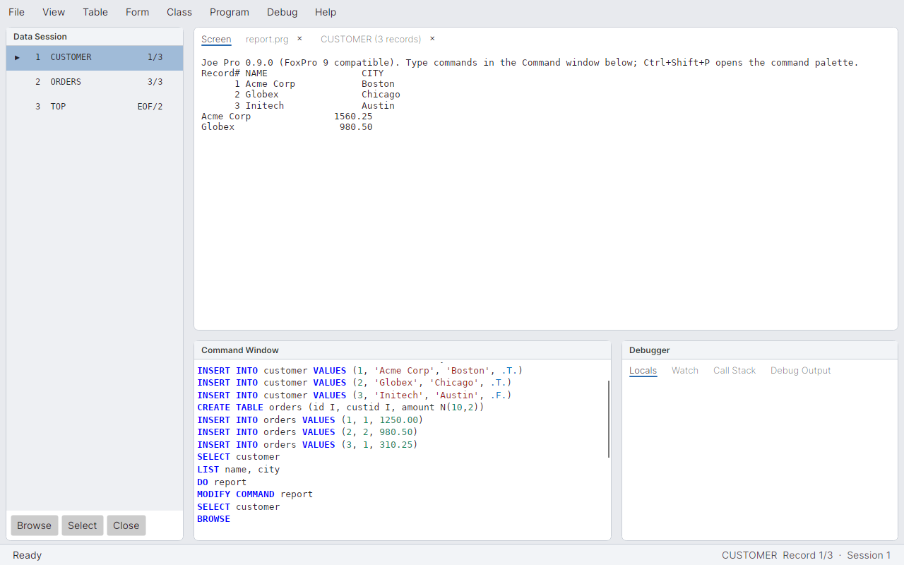 | 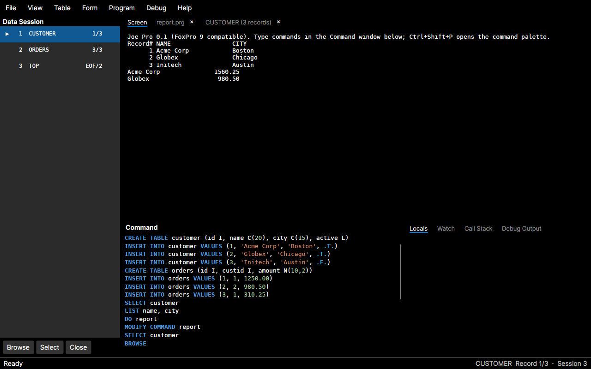 |

| Code editor | A form from a .jpform file |
|---|---|
| 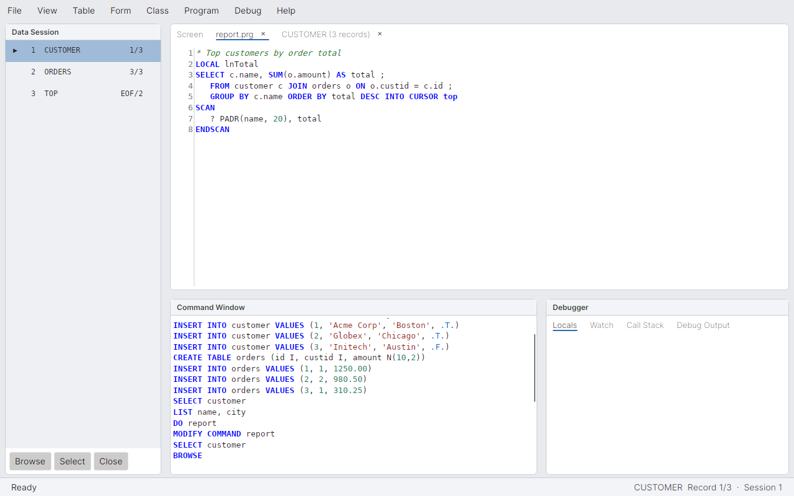 | 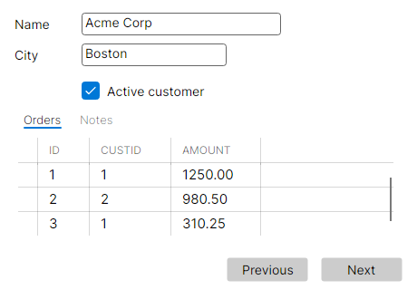 |

| Form Designer | Class Browser |
|---|---|
| 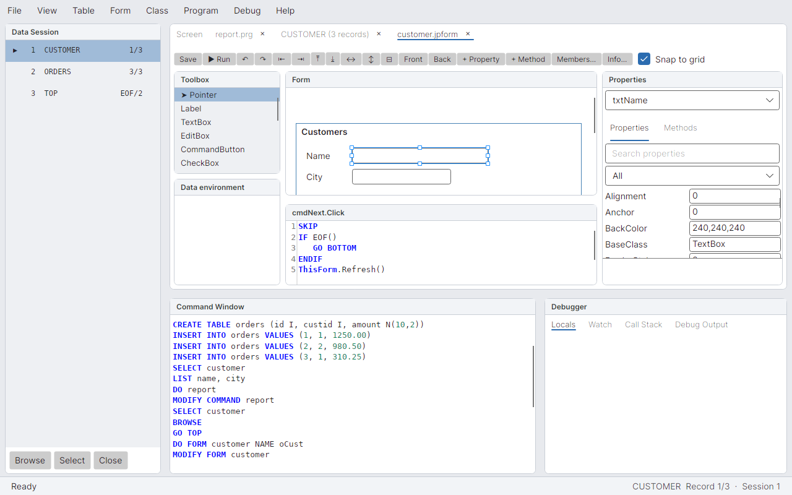 | 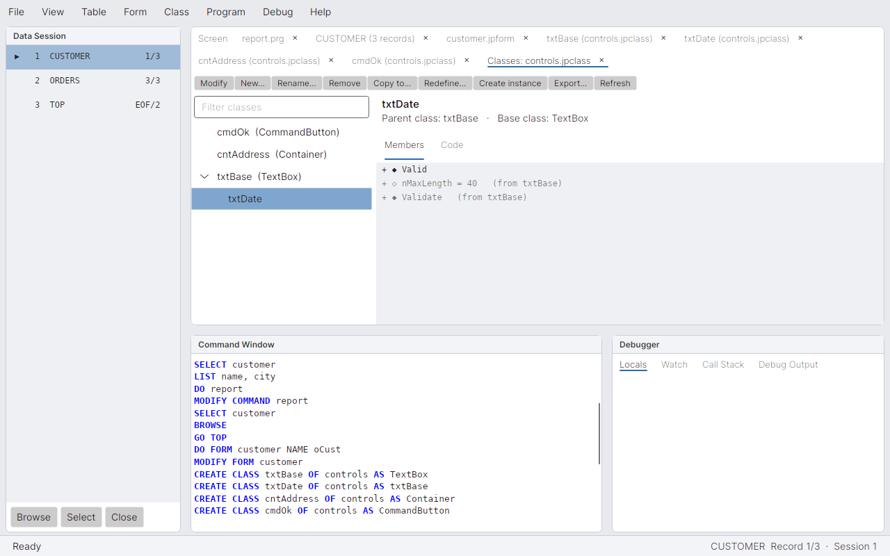 |

| Report Designer with live preview | Report preview |
|---|---|
| 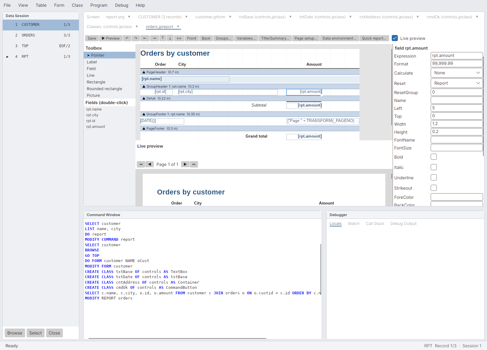 | 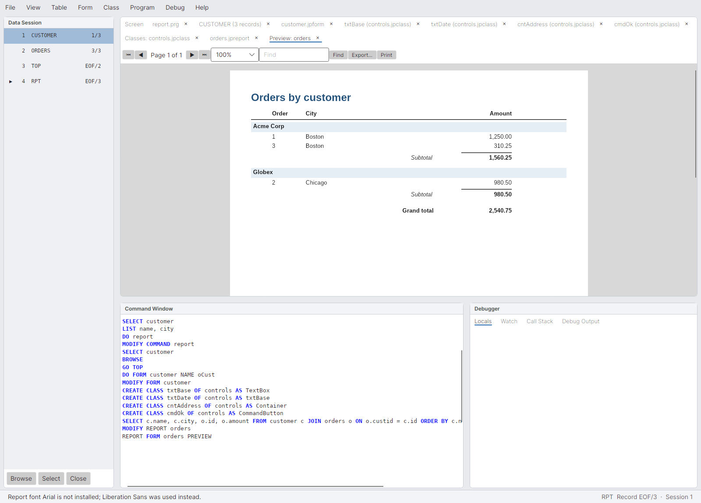 |

| Database Designer (relation selected, RI rules) | Table Designer |
|---|---|
| 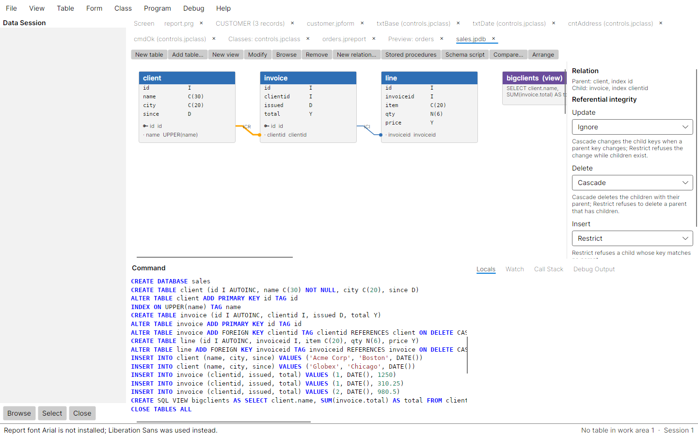 | 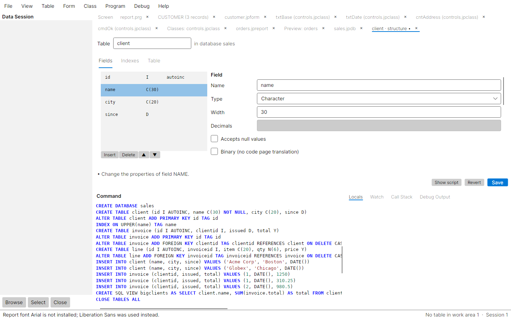 |

| Query Designer with results | Menu Designer |
|---|---|
| 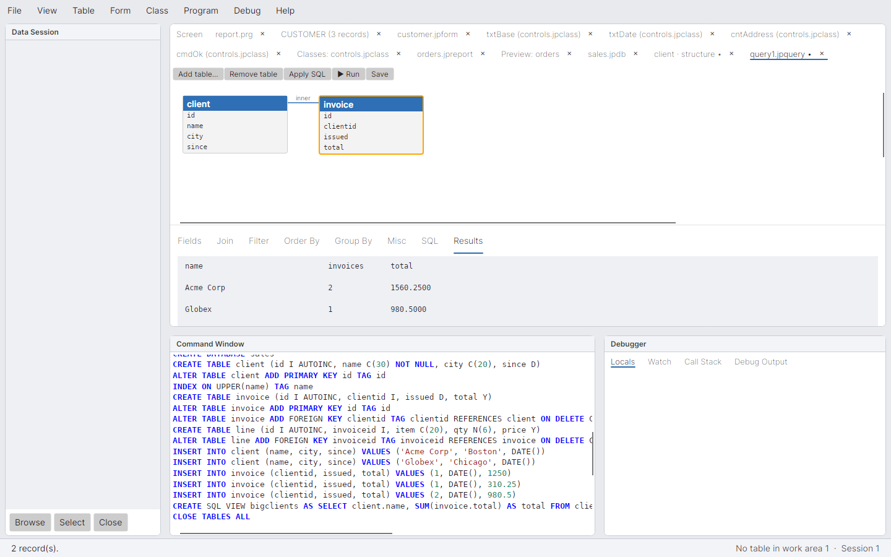 | 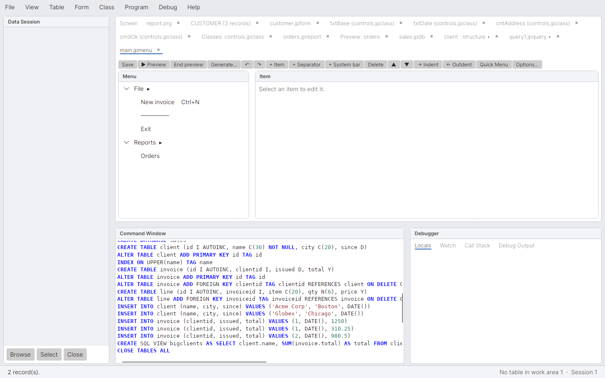 |

| Project Manager | Migration report after the wizard |
|---|---|
| 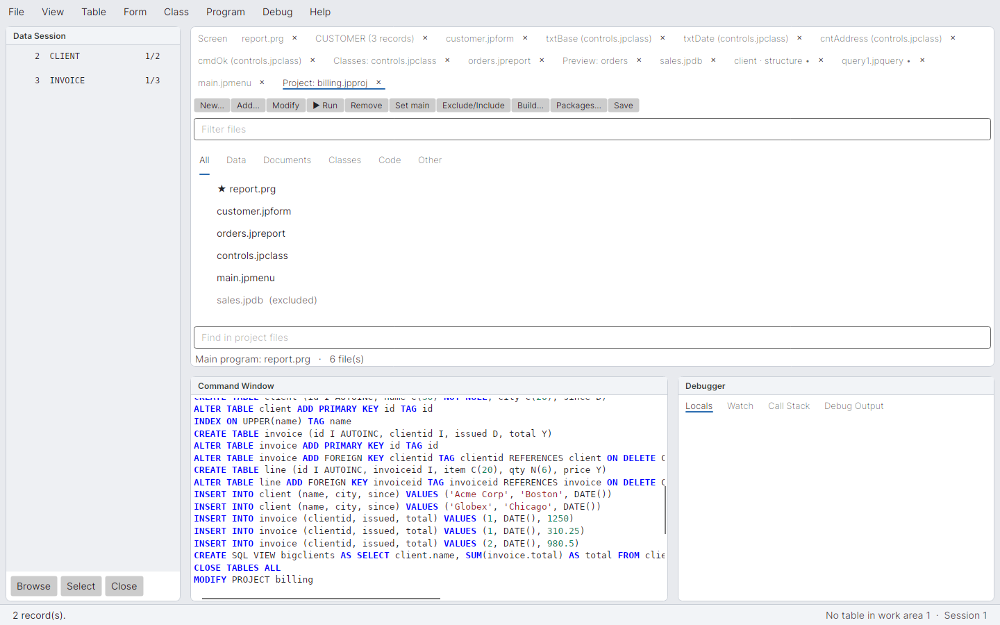 | 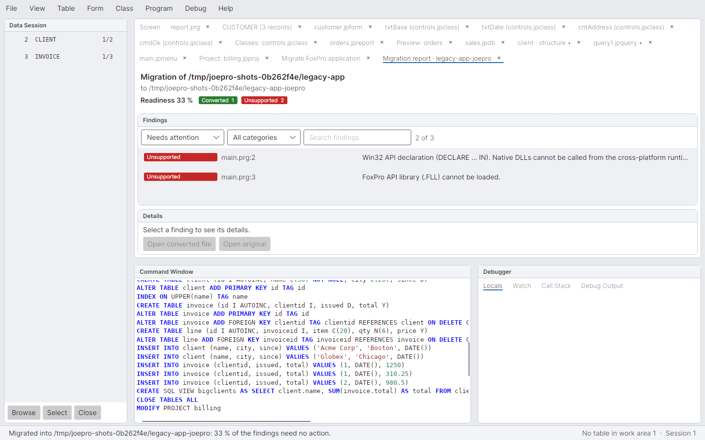 |

## Known gaps in the UI (Phase 1)

- The form runtime covers the common controls. Not supported: OLE/ActiveX controls. Toolbars float in their own
  window; `Dock()` records the position but does not dock the toolbar into another window yet.
- `READ EVENTS` and modal forms use nested dispatcher loops. They have only been exercised headlessly, not yet on a real desktop.
- The IDE has not been launched on a real Windows/macOS/Linux desktop in this environment; it is exercised by headless UI tests and rendered screenshots.

## Tests

Run `dotnet test`. `JoePro.Tests` covers core semantics, legacy file reading (including real VFP files),
the data engine, the parser, the runtime (language, commands, SQL) and migration. `JoePro.Ui.Tests` runs
the form runtime and the IDE shell headlessly (Avalonia headless platform).
